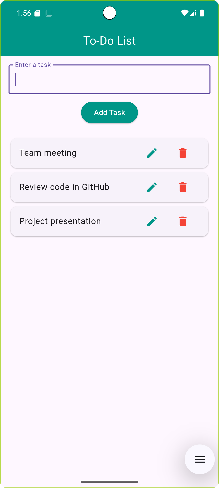

# 📝 Flutter To-Do List App

This is a basic Flutter to-do list application that allows users to:

- ✅ Add tasks
- 📝 Edit tasks
- 🗑️ Delete tasks
- 📋 View tasks in a styled ListView

It's designed for beginners to understand Flutter's `StatefulWidget`, `TextField`, `ListView`, and UI interaction basics using dialog boxes and buttons.

---

## 📸 Screenshots




---

## 🛠️ Features

- Add new task with input field and button
- Edit existing tasks using a popup dialog
- Delete tasks individually
- Clean, responsive UI using Material Design
- Light padding and custom colors using the `teal` color scheme

---

## 🚀 Getting Started

- Flutter SDK installed
- Android Studio or Visual Studio Code
- Android Emulator or physical device

### Run the App

```bash
flutter pub get
flutter run
